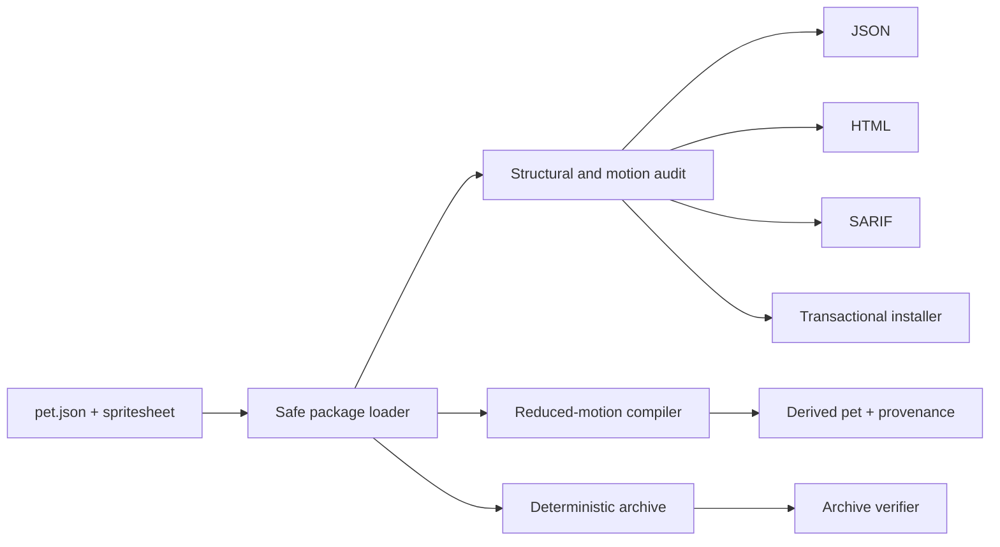

# Architecture

## Boundaries

The repository has three independent layers:

1. `pet/` — the final, app-consumable Momo Ayase pet package.
2. `src/petease/` — a character-agnostic Python library and CLI.
3. `site/` — a static, local-only atlas explorer used for release previews.

No layer reads Codex conversations or calls an online service.

## Data flow

## Modules

| Module | Responsibility |
| --- | --- |
| `atlas.py` | Safe manifest loading, contained sprite paths, image decoding, cells, checksums |
| `audit.py` | Structural errors, motion metrics, stable finding codes and repairs |
| `compile.py` | Deterministic medoid selection and reduced-motion atlas creation |
| `install.py` | Dry-run plan, staging, checksum verification, backup, rollback |
| `archive.py` | Deterministic `.codex-pet` transport archive and safety verification |
| `report.py` | Human-readable HTML and canonical JSON |
| `sarif.py` | GitHub-compatible SARIF 2.1.0 |
| `cli.py` | Stable commands and exit codes |

## Codex v2 contract

- Cell: 192×208 px.
- Atlas: 8 columns × 11 rows = 1536×2288 px.
- Rows 0–8: nine standard animation states.
- Rows 9–10: sixteen clockwise look directions.
- Used cells must contain visible pixels.
- Unused cells in standard rows must be fully transparent.
- No used frame may touch a cell edge.
- Fully transparent pixels must have zero RGB.

The row counts and timings live in one table in `petease.model`. Audit,
compiler, tests, and preview all consume the same contract instead of
duplicating magic numbers.

## Motion metrics

For every adjacent frame pair, including loop closure, PetEase records:

- normalized mean RGBA pixel delta;
- normalized luminance delta after compositing on neutral gray;
- alpha-bounding-box centroid shift in pixels;
- visible-area change ratio.

Threshold crossings are warnings, not structural errors. Authors can tune them
with a policy file. Structural checks cannot be disabled through policy.

## Reduced-motion algorithm

For each standard state, PetEase selects the medoid: the frame with the lowest
sum of weighted distances to all other frames. Ties resolve to the lowest frame
index. Idle intentionally uses frame zero because Codex's still presentation
convention makes the first idle pose the least surprising fallback.

All used cells in a standard row receive that still. The sixteen look cells are
preserved because they are static directional poses, not an animation loop.
The compiler records every selection and both atlas checksums.

## Safety properties

- Sprite paths are non-empty, relative, and contained within the package.
- Symlinks are rejected during installation and packaging.
- Installations are staged before the existing destination is moved.
- A staged sprite checksum must equal the audited source checksum.
- Failure after backup restores the previous install.
- `--force` cannot erase the source or an unrelated non-empty directory.
- Archives use fixed metadata and reject absolute or parent-traversal entries.

## Reproducibility

`.codex-pet` entry order, timestamps, permissions, compression level, and input
set are fixed. The release gate builds twice in separate temporary directories
and compares SHA-256 hashes.
